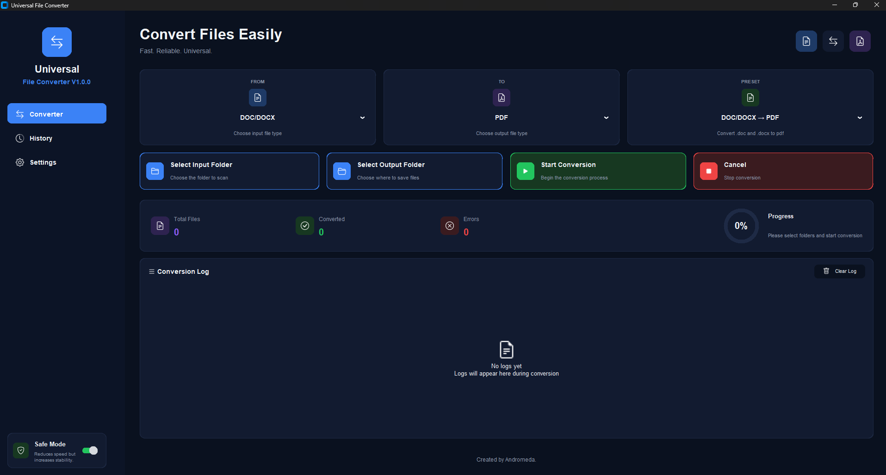
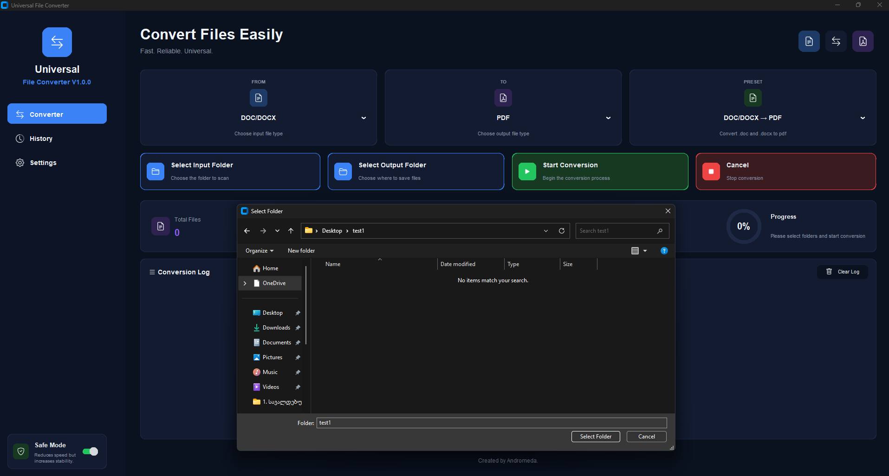
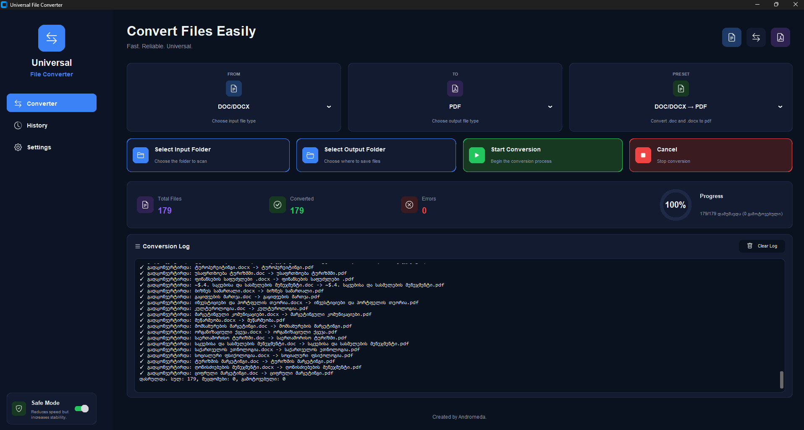

# Universal File Converter

## აღწერა

Universal File Converter არის Python აპლიკაცია, რომელიც ახდენს DOC/DOCX, PDF და TXT ფორმატების ორმხრივ (ან ერთმხრივ) კონვერტაციას, და აქვს თანამედროვე CustomTkinter UI.

## ძირითადი თვისებები

- DOC/DOCX → PDF
- DOC/DOCX → TXT
- PDF → DOCX
- PDF → TXT
- TXT → DOCX
- TXT → PDF
- Safe Mode არჩევანი სტაბილურობისთვის
- გვერდითი ნავიგაცია, სტატისტიკა და კონვერსიის ლოგინგი

## ფაილური სტრუქტურა

```
Universal File Converter/
├── .venv/                       # ვირტუალური გარემო (optional)
├── app/
│   ├── core/
│   │   ├── constants.py         # აპის ფერები, პრესეტები და სეტები
│   │   ├── converter.py         # მთავრი კონვერტაციის ლოგიკა
│   │   └── word_session.py      # Word COM სესიის მართვა
│   ├── ui/
│   │   ├── app.py               # მთავარი UI და მომხმარებლის ინტერფეისი
│   │   └── widgets.py           # UI კომპონენტები და ვიზუალური ელემენტები
│   └── __init__.py
├── icons/                       # აპისთვის საჭირო PNG აიქონები
├── screenshots/                 # UI სქრინშოტები და პრეზენტაცია
├── requirements.txt             # საჭირო Python პაკეტები
├── run.py                       # აპის ახალი გაშვების წერტილი
└── README.md                    # ამ დოკუმენტის წესი და ინსტრუქციები
```

## მოთხოვნები

- Python 3.8+ (შეხედე `.venv` თუ უკვე გაქვს შექმნილი)
- Windows მხოლოდ Word COM კონვერტაციებისთვის

## ინსტალაცია

1. გადადით პროექტის ფოლდერში:

```powershell
cd "c:\Users\Admin\Desktop\Universal File Converter"
```

2. შექმენით და გაააქტიურეთ ვირტუალური გარემო:

```powershell
python -m venv .venv
.venv\Scripts\Activate.ps1
```

3. დააინსტალირეთ საჭირო პაკეტები:

```powershell
pip install -r requirements.txt
```

## გაშვება

```powershell
python run.py
```

> თუ `PowerShell`-ში სქრიპტების გაშვება დაბლოკილია, გამოიყენეთ:
>
> ```powershell
> Set-ExecutionPolicy -Scope CurrentUser RemoteSigned
> ```

## როგორ მუშაობს

1. აირჩიეთ `Select Input Folder` და `Select Output Folder`.
2. მიუთითეთ ფორმატი `FROM` და `TO` ჩამოშლად მენიუებში.
3. დააჭირეთ `Start Conversion`.
4. შეგიძლია ნახო სტატისტიკა და კონვერსიის ლოგი.

## მნიშვნელოვანი შენიშვნისა

- DOC/DOCX → PDF და PDF → DOC/DOCX კონვერტაცია მუშაობს მხოლოდ Windows-ზე, Microsoft Word-ით და `pywin32` პაკეტით.
- PDF → TXT და TXT → DOCX კონვერტაცია შესაძლებელია პლატფორმის გარეშე.

## სურათები







